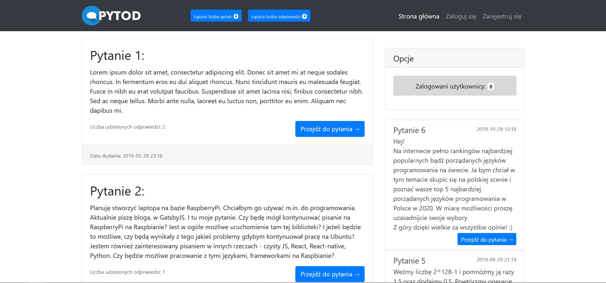
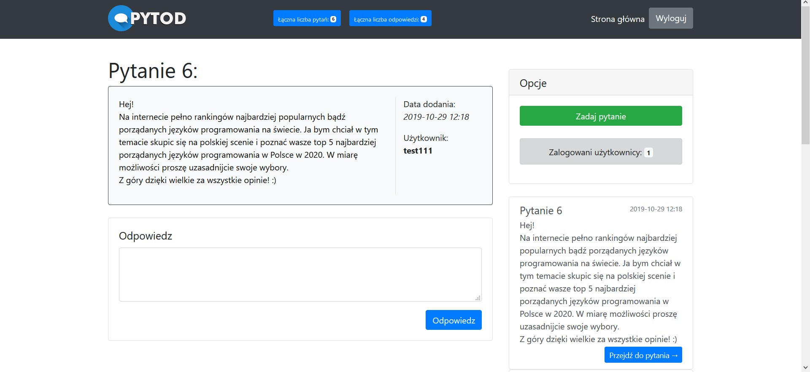
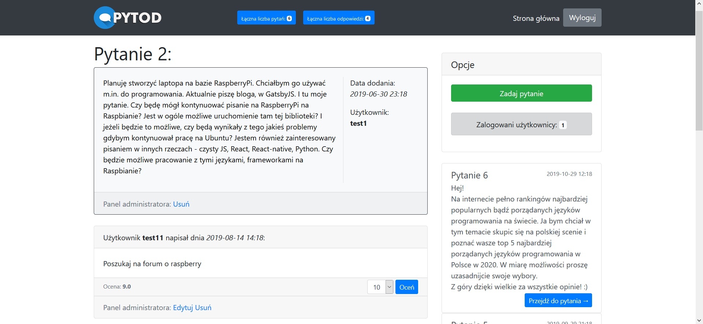
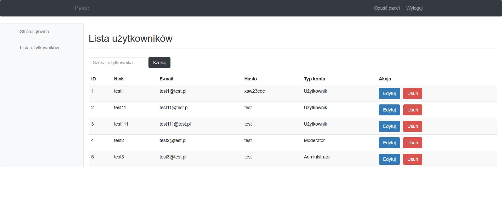
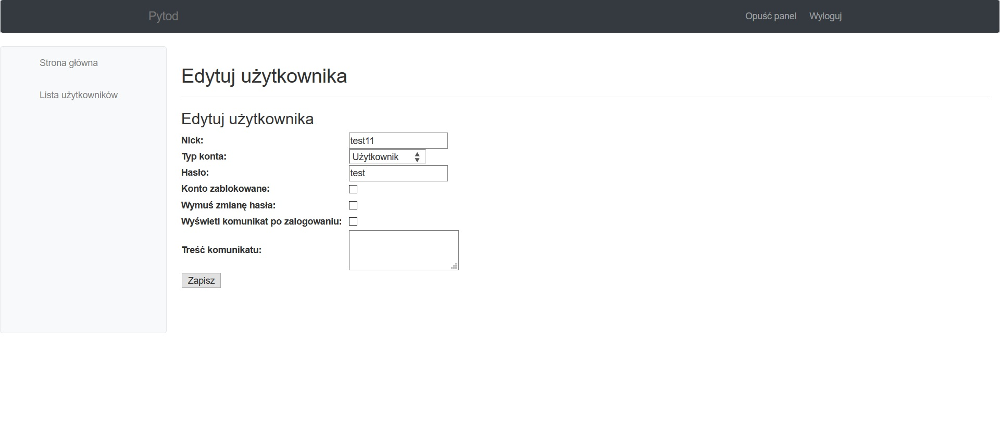

# Pytod
> The application was created as a student project. This page works similar as StackOverflow. Users can ask questions and answer other users questions.

## Technologies
* Java 8
* Servlets
* JSP (JSTL)
* JSF
* JDBC
* MySQL
* Bootstrap 4

## Release History
When creating the application, I had to implement several functions at different stages:
* ##### 1.0
    * Logged in users can ask questions and answer.
    * Users, posts and answers are store in JSON files.
    * Guests and users can read posts and search by title.
    * Saving the user's IP address in case of login failure (using the filter).
    * The number of posts on a home page must be set as the init parameter.
    * Some elements of the page must be different in different browsers (using the filter).
    * The application must show the number of currently logged in users (using the listener).
* ##### 1.1
    * Divide pages into elements such as header, navigation bar, main content, footer.
    * Add pages such as: my account, my questions, my answers.
    * Build your own tag to allow logged in users to rate answers. One user can only rate a answers on a scale of 1-10 once. Store grades in a JSON file. Display the average rating of each answers in the footer.
* ##### 1.2
    * Store data such as users, posts, answers and grades in a database (MySQL) 
    * Use JSTL library to manage data in database (CRUD)
    * Add the admin role to the application. Permit to: delete posts, delete answers, edit answers.
* ##### 1.3 - currently
    * Create module to manage accounts of users in JSF framework. Only admin have permissions to log in.
    Possibilities:
        * change user account type,
        * change user password,
        * delete user accounts,
        * block and unblock users,
        * set an alert that will be displayed after the user logs in,
        * force password change after the user logs in.
      
## Screenshots

---

---

---

---

